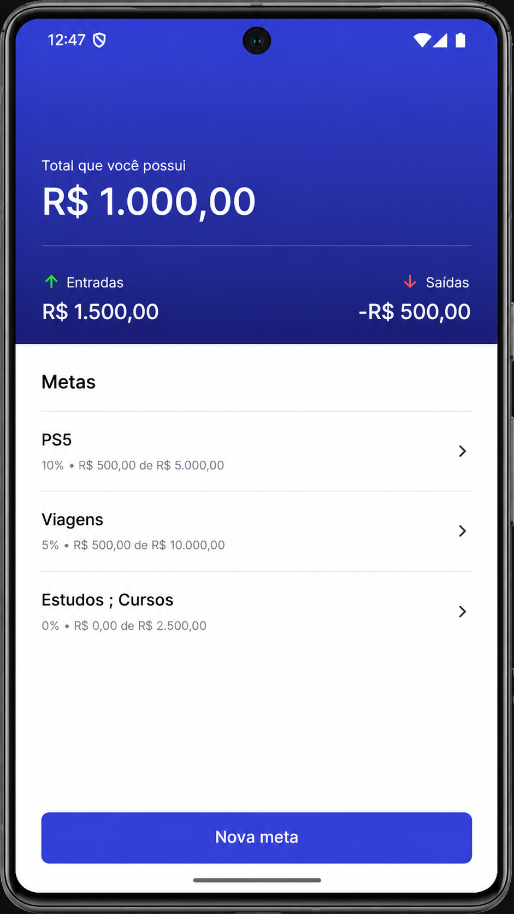
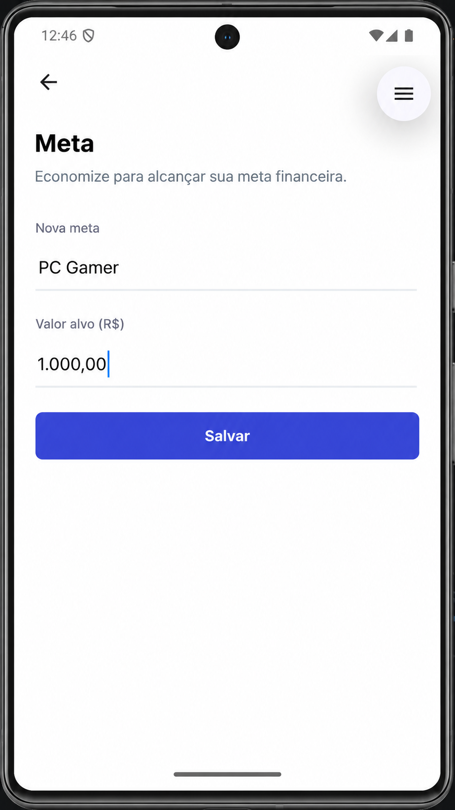

# 🎯 Targets — Gestão de Metas Financeiras

Aplicativo mobile de **gestão de metas financeiras**, desenvolvido como parte da formação em **React Native da Rocketseat**.

Com o Targets, é possível organizar objetivos financeiros, acompanhar quanto já foi guardado e registrar entradas e saídas de valores, com persistência local dos dados.

## 📱 Telas do aplicativo

<p align="center">
  
  
  
</p>

---

## ✨ Funcionalidades

- 🎯 Criação e edição de metas financeiras
- 📋 Listagem de metas e acompanhamento do progresso de cada objetivo
- 💰 Registro de transações de entrada e saída vinculadas às metas
- 📊 Histórico de transações com valor, data e observação
- 🧮 Resumo financeiro de entradas, saídas e saldo
- 💾 Armazenamento local com SQLite
- ✅ Validação dos dados informados nos formulários

---

## 🛠️ Tecnologias utilizadas


### Principais ferramentas

| Tecnologia | Utilização |
|---|---|
| React Native | Desenvolvimento da interface mobile |
| Expo | Ambiente e ferramentas de desenvolvimento |
| TypeScript | Tipagem estática e organização do código |
| Expo Router | Navegação entre telas |
| expo-sqlite | Persistência local de dados |
| React Hooks | Gerenciamento de estados e efeitos |

### 🏷️ Topics

`react-native` · `expo` · `typescript` · `sqlite` · `mobile-app` · `financial-goals`

---

## 📚 Aprendizados

Durante o desenvolvimento deste projeto, aprofundei meus conhecimentos em:

- Estruturação de aplicações React Native com componentes reutilizáveis
- Navegação e passagem de parâmetros com Expo Router
- Criação e gerenciamento de tabelas SQLite
- Operações assíncronas e consultas ao banco de dados
- Desenvolvimento de hooks personalizados para acesso aos dados
- Formatação de valores monetários e validação de formulários
- Construção de interfaces para acompanhamento de metas financeiras
- Organização e manutenção do código com TypeScript

---

## 🚀 Como executar o projeto

### Pré-requisitos

- Node.js e npm instalados
- Ambiente Expo configurado
- Android Studio e Android SDK configurados para execução no emulador Android

### 1. Clonar o repositório

```bash
git clone https://github.com/NandoAmadoDev/target-react-native.git
```

### 2. Acessar a pasta

```bash
cd target-react-native
```

### 3. Instalar as dependências

```bash
npm install
```

### 4. Iniciar o Expo

```bash
npx expo start
```

### 5. Executar no Android

Com o emulador ou dispositivo Android configurado:

```bash
npx expo run:android
```

---

## 👨‍💻 Sobre o desenvolvimento

Este projeto foi desenvolvido durante minha jornada de aprofundamento em desenvolvimento mobile.

Após mais de **16 anos de experiência no desenvolvimento de sistemas corporativos**, sigo ampliando meus conhecimentos e explorando novas tecnologias, especialmente **React Native, Expo e TypeScript**.

O Targets representa mais uma etapa dessa evolução profissional, consolidando conhecimentos em desenvolvimento mobile, navegação, persistência de dados e organização de aplicações.

> 🚀 **A experiência que construí até aqui não é o fim da jornada. É a base para o próximo nível.**

---

### Desenvolvido por

**[Fernando Amado — NandoAmadoDev](https://github.com/NandoAmadoDev)**

Projeto de aprendizado desenvolvido durante a formação em React Native da **Rocketseat**.